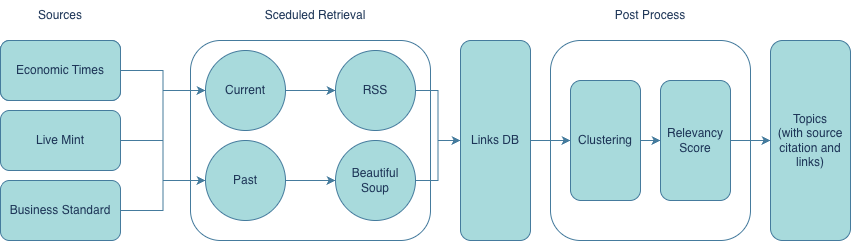

# TrendSense

## Description
TrendSense is an AI-powered article research tool designed to track trends across timeframes and predict which of today’s emerging topics are likely to remain relevant in the future.

The need for such a tool arose while we were researching topics for ENIGMA, the annual magazine published by SIGMA — The Business Club of NIT Trichy. We found it challenging to identify article themes that would still be meaningful months later, at the time of publication.

TrendSense was created to solve this problem by analyzing ongoing trends, understanding their trajectory, and estimating which ones are likely to persist — helping writers choose topics with long-term relevance.

## TrendSense Architectrure
